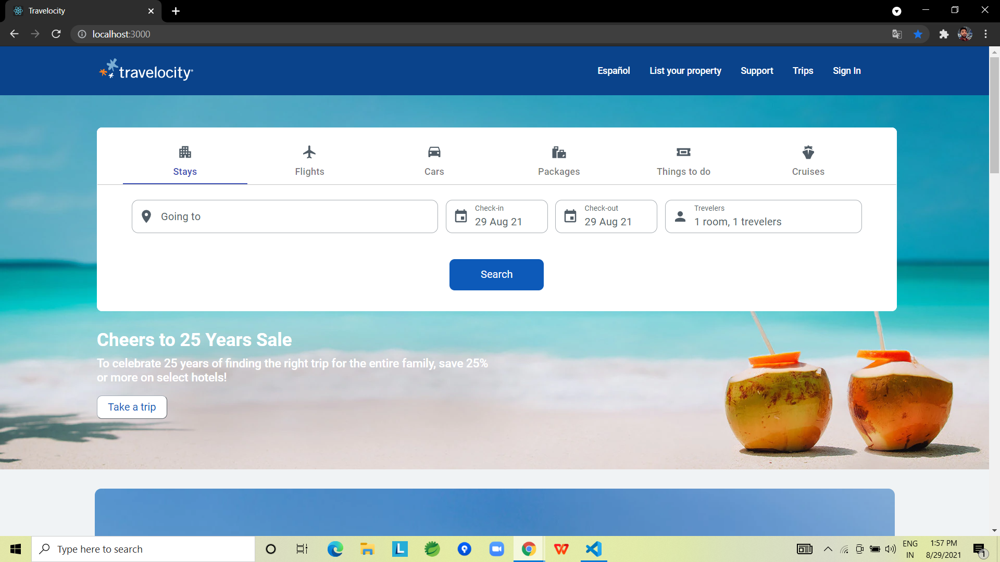
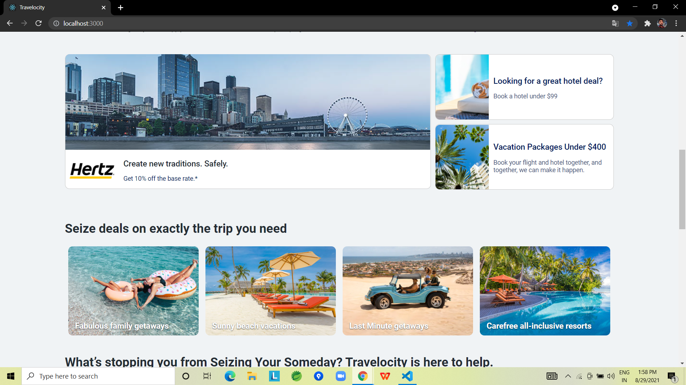
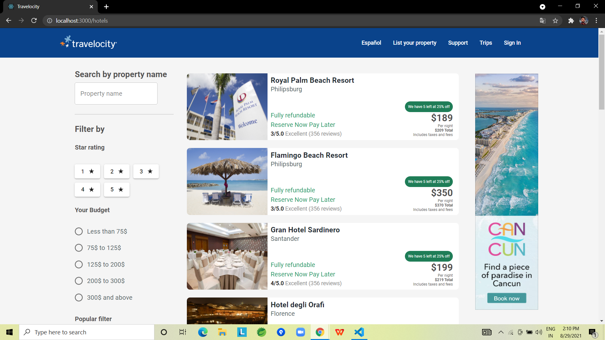
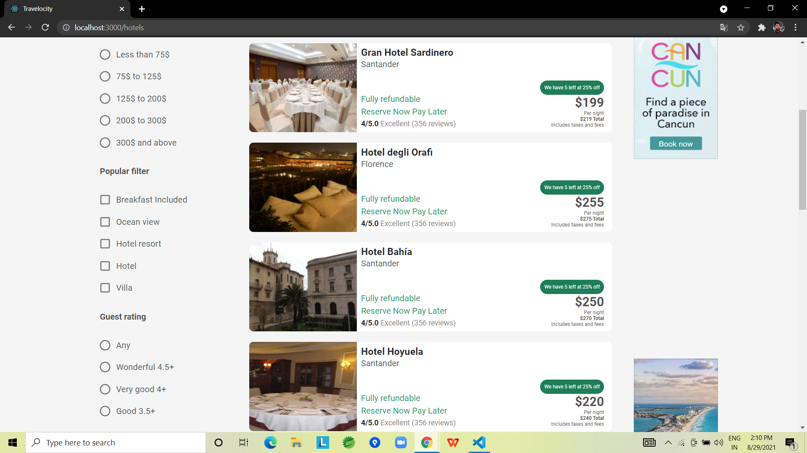
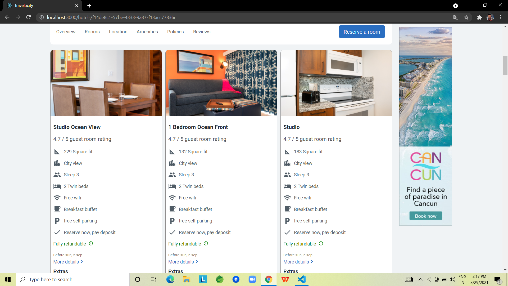
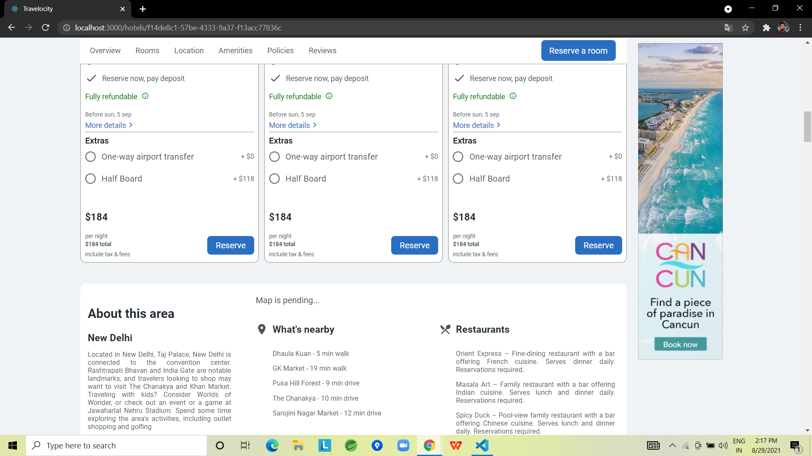
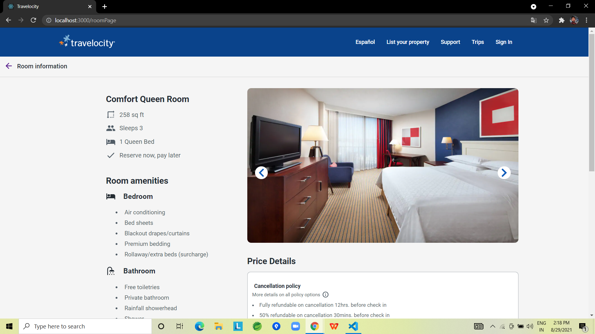
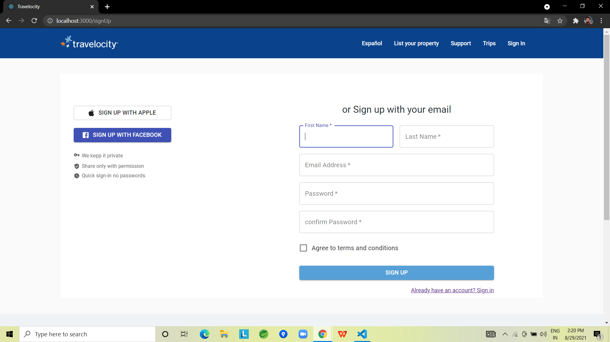

# Travelocity Clone Project
This is the clone of the travelocity website. Travelocity is a online travel agency. From this website users can book a hotel rooms, flights, cars etc. across the world.

## How to run the app
<ul>
  <li>Clone the repo and run following command to start the application.</li>
  <ul>
    <li>git clone https://github.com/sheikhtausif/travelocity-clone</li>
    <li>cd travelocity-clone</li>
    <li>npm i</li>
    <li>npm start</li>
    <li>json-server --watch db.json --port 3001(on new terminal)</li>
  </ul>
</ul>

## Built with
<ul>
  <li>React js</li>
  <li>Redux</li>
  <li>HTML</li>
  <li>CSS</li>
</ul>

## Used libraries
<ul>
  <li>node modules</li>
  <li>Styled-Components</li>
  <li>axios</li>
  <li>React</li>
  <li>Redux</li>
  <li>React-router-dom</li>
  <li>Material UI</li>
  <li>React Icon</li>
</ul>

## Features
<ul>
  <li>Signin/Signup</li>
  <li>Hotel search across world's cities</li>
  <li>Hotel Booking</li>
  <li>Filter hotels list by their ratings, hotel name and price etc.</li>
</ul>

## Demo video of the project
  <a href="https://drive.google.com/file/d/19y80aIQ5vILaLQNsjLNZPbzLdnRvDyua/view?usp=sharing">Click here to watch demo video</a>
  
## Some screenshots of the project

## Team members
<ul>
  <li>Chandan Gupta</li>
    <ul>
      <li>Gmail (gupta.chandan1499@gmail.com)</li>
      <li>Github <a href="https://github.com/chandan1499">https://github.com/chandan1499</a></li>
    </ul>
  <li>Aditya Kumar</li>
    <ul>
      <li>Gmail (onlyaditya001@gmail.com)</li>
      <li>Github <a href="https://github.com/onlyaditya">https://github.com/onlyaditya</a></li>
    </ul>
  <li>Mohd Tausif</li>
    <ul>
      <li>Gmail (mohammadtausif14@gmail.com)</li>
      <li>Github <a href="https://github.com/sheikhtausif">https://github.com/sheikhtausif</a></li>
    </ul>
  <li>Millind</li>
    <ul>
      <li>Gmail (milinddev1011@gmail.com)</li>
      <li>Github <a href="https://github.com/Milind-dev">https://github.com/Milind-dev</a></li>
    </ul>
</ul>

## Read project blog
<a href="https://chandan1499.hashnode.dev/travelocity-clone">Travelocity_clone blog</a>

